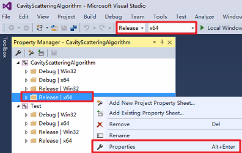

# CavityScatteringLibrary

*CavityScatteringLibrary* 库封装了一种改进的有限元方法

***关于CavityScatteringLibrary的介绍有待后续完善***

## 1.	下载源文件
### 1.1 选择你要保存代码仓库的位置，打开git bash

### 1.2 克隆代码
```github
git clone git@github.com:monkeyDemon/CavityScatteringLibrary.git
```
### 1.3 文件的分布


## 2.	安装并配置MATLAB环境
MATLAB在方程求解方面的速度优势是令人称赞的，因此我们的C++程序中会调用MATLAB引擎进行方程的求解以及一些其它的绘图工作。因此在编译项目前，需要安装并配置MATLAB环境。

### 2.1 安装MATLAB
首先确保电脑中安装有MATLAB，安装方法这里不做介绍。
我们的程序调用MatlabR2015b版本引擎的正确性是可以保证的，其它版本及Octave的正确性没有验证，欢迎反馈。
### 2.2 添加环境变量
在 系统变量(S)->Path中添加
```
C:\Program Files\MATLAB\R2015b\bin\win64
```
*注 :你需要根据计算机的实际情况修改上面的路径，包括后文中所有出现的路径，不再赘述。*
### 2.3 注册服务
首先打开cmd

注意要以管理员身份运行

随后切换到MATLAB安装目录下的bin文件夹中：
```
cd C:\Program Files\MATLAB\R2015b\bin
```
最后执行：
``` matlab
matlab/regserver
```


## 3.	安装Eigen库
Eigen是一个C++的线性代数库，提供矩阵，向量，数值求解和一些相关的算法。

直接下载Eigen库到任意指定的目录即可，无需安装。

你可以从github上获取[Eigen库](https://github.com/eigenteam/eigen-git-mirror)

更多关于Eigen的信息[参见](http://eigen.tuxfamily.org/)


## 4.	配置项目
使用VS2015打开解决方案CavityScatteringAlgorithm，然后完成以下配置即可
### 4.1 配置CavityScatteringAlgorithm项目
**打开属性管理器：**

视图->其他窗口->属性管理器

根据所需的编译平台，如：x64 & Release

进入相应的属性页面



**添加包含目录：**
```
C:\Program Files\MATLAB\R2015b\extern\include
D:\C-Library\Eigen
```
**添加库目录：**
```
C:\Program Files\MATLAB\R2015b\extern\lib\win64\microsoft
```


**在 链接库->输入 中添加**
```
libeng.lib
libmat.lib
libmex.lib
libmx.lib
```
完成以上配置后，即可生成CavityScatteringAlgorithm项目


### 4.2 配置Test项目
**添加包含目录：**
```
C:\Program Files\MATLAB\R2015b\extern\include
D:\C-Library\Eigen
D:\CavityScatteringLibrary\CavityScatteringAlgorithm
```
**添加库目录：**
```
C:\Program Files\MATLAB\R2015b\extern\lib\win64\microsoft
D:\CavityScatteringLibrary\x64\Release
```
**在 链接库->输入 中添加**
```
CavityScatteringAlgorithm.lib
libeng.lib
libmat.lib
libmex.lib
libmx.lib
```


### 4.3 生成整个解决方案

**首先将Test项目设置为启动项目**

**然后重新生成整个解决方案即可**

现在你可以尝试运行测试项目Test了

它包含了调用 *CavityScatteringLibrary* 库的若干示例

*注：若最终程序运行中提示无法打开MATLAB引擎，你可以按照2.3的说明重新注册matlab服务。*

## 5.	更多信息

如何调用 *CavityScatteringLibrary* 库，请参见Test.cpp库中的若干示例

如需更详细了解，Test中使用的算例对应的参考文献位于CitedSource文件夹中

更多关于代码或算法的详情请联系：

论文作者1：***作者1***

论文作者2：***作者2***

论文作者3：***作者3***

C++ program Coder：***anshengmath@gmail.com***

MATLAB program Coder：
